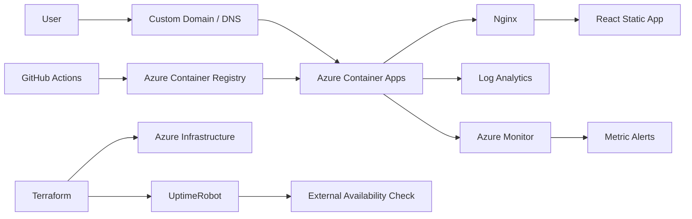

# DevOps Portfolio

Production-like DevOps and Cloud portfolio built to demonstrate containerization, Infrastructure as Code, CI/CD, cloud security, and observability practices.

🌐 **Live:** https://matgaldino.com.br

## Architecture



## Stack

### Application

- React
- TypeScript
- Vite
- Nginx
- Docker

### Cloud

- Azure Container Apps
- Azure Container Registry
- Azure Managed Identity
- Azure Log Analytics
- Azure Monitor

### Infrastructure as Code

- Terraform
- AzureRM Provider
- AzAPI Provider
- UptimeRobot Provider
- Remote Terraform state in Azure Blob Storage

### CI/CD

- GitHub Actions
- GitHub OIDC authentication with Azure
- Trivy container vulnerability scanning
- Immutable image deployments using SHA256 digests
- Protected Terraform plan/apply workflow

## CI/CD

Application changes follow this pipeline:

```text
Pull Request
    ↓
Lint
Tests
Build
Docker Build
Trivy Scan
    ↓
Merge to main
    ↓
Build release image
Trivy Scan
Push to Azure Container Registry
Resolve image digest
Deploy exact digest to Azure Container Apps
```

The production deployment uses the image SHA256 digest instead of a mutable tag, ensuring that the exact image tested by the pipeline is deployed.

## Infrastructure

Azure infrastructure is managed with Terraform.

Terraform changes use a separate protected workflow:

```text
Pull Request
    ↓
terraform validate
terraform plan
    ↓
Merge to main
    ↓
Create exact Terraform plan
Store plan in private Azure Blob Storage
    ↓
Manual production approval
    ↓
terraform apply saved plan
```

This prevents infrastructure changes from being applied without review and ensures that the reviewed plan is the same plan applied to production.

## Security

The project applies several security practices:

- GitHub → Azure authentication through OIDC
- No long-lived Azure credentials stored in GitHub
- Least-privilege Azure RBAC
- Managed Identity for Container App access to ACR
- ACR admin account disabled
- Private Terraform state storage
- Protected `main` branch
- Trivy image vulnerability scanning before deployment
- Container images deployed using immutable SHA256 digests
- Secrets stored using GitHub Actions Secrets

## Observability

The application includes multiple layers of observability.

### Health Checks

The container exposes:

```text
/health
```

Azure Container Apps uses this endpoint as a liveness probe to detect unhealthy containers and restart them automatically.

### Logs

Application and platform logs are sent to Azure Log Analytics.

Examples include:

- Nginx HTTP access logs
- Container lifecycle events
- Image pulls
- Replica creation
- Health probe failures
- Container restarts

Logs can be analyzed using KQL.

### Metrics

Azure Monitor collects metrics including:

- HTTP requests
- Replica count
- CPU usage
- Memory usage
- Container restart count

### Alerts

An Azure Monitor metric alert watches the container restart count.

```text
RestartCount > 0
    ↓
Azure Monitor Metric Alert
    ↓
Azure Action Group
```

### External Availability Monitoring

UptimeRobot performs an external HTTP check every 5 minutes against:

```text
https://matgaldino.com.br
```

This validates the complete public path:

```text
DNS
→ TLS/HTTPS
→ Azure ingress
→ Container App
→ Nginx
→ Website
```

The monitor is also managed through Terraform.

## Container Architecture

The application uses a multi-stage Docker build:

```text
Node.js
    ↓
npm ci
npm run build
    ↓
Static production files
    ↓
Nginx
```

The Node.js environment only exists during the build stage. The production container contains Nginx and the compiled static application.

## Local Development

Install dependencies:

```bash
npm ci
```

Run the development server:

```bash
npm run dev
```

Run validation:

```bash
npm run lint
npm test
npm run build
```

## Docker

Build the image:

```bash
docker build -t portfolio-devops .
```

Run locally:

```bash
docker run --rm -p 8080:80 portfolio-devops
```

Then access:

```text
http://localhost:8080
```

Health endpoint:

```text
http://localhost:8080/health
```

## Terraform

Infrastructure code is located in:

```text
terraform/
```

Basic local validation:

```bash
terraform fmt -check
terraform validate
terraform plan
```

Terraform state is stored remotely in Azure Blob Storage.

## Project Goals

This project is designed as a practical environment for studying and demonstrating:

- Cloud infrastructure
- Infrastructure as Code
- CI/CD
- Containerization
- Cloud security
- Identity and access management
- Observability
- Production deployment practices